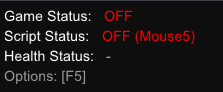
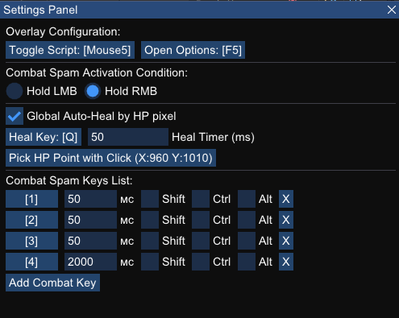
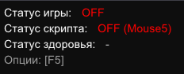
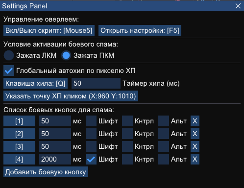

# Diablo 4 Overlay Rotation Spam

[English](#english) | [Русский](#русский)

---

## English

A lightweight, high-performance overlay and macro automation tool for Diablo 4, written in pure C++ using **Dear ImGui** and **DirectX 11**. It bypasses high CPU usage common with scripting engines and provides a minimal footprint.

### Features
* **Minimalist Status HUD:** A tiny `240x100` transparent window showing Game, Script, and Health status directly over the game.
* **Smart Click-Through:** The overlay is completely click-through while gaming. Pressing the custom Options key instantly activates the cursor for configuration.
* **Global Pixel Auto-Heal:** Dynamically scans a specified pixel on your health globe and triggers the heal key only when health drops and combat keys are held.
* **Interactive Position Picker:** Click a single button in settings, then left-click anywhere on your screen to set the exact health pixel coordinates.
* **Dynamic Combat Spam:** Add any number of skills with custom independent millisecond timers.
* **Persistent Settings:** Automatically saves all your hotkeys, timers, and pixel configurations to a local `config.txt` file.

### Interface Preview

  
  

---

## Русский

Легкая, высокопроизводительная утилита-оверлей автоматизации макросов для Diablo 4, написанная на чистом C++ с использованием **Dear ImGui** и **DirectX 11**. Она полностью исключает высокую нагрузку на процессор, свойственную обычным скриптовым движкам, и имеет минимальный размер.

### Возможности
* **Минималистичный HUD статуса:** Крошечное прозрачное окно `240x100` отображает статус игры, скрипта и здоровья прямо поверх игрового клиента.
* **Умный сквозной клик (Click-Through):** Оверлей полностью пропускает клики мыши во время игры. Нажатие клавиши Опций мгновенно включает курсор для настройки.
* **Глобальный автохил по пикселю:** Динамически сканирует выбранную точку на сфере здоровья и прожимает хил только тогда, когда ХП падает во время боя.
* **Интерактивный выбор координат:** Нажмите одну кнопку в меню, кликните левой кнопкой мыши в любой точке экрана игры, и точные координаты ХП запишутся автоматически.
* **Динамический боевой спам:** Возможность добавлять любое количество клавиш с уникальными независимыми таймерами задержки в миллисекундах.
* **Сохранение конфигурации:** Автоматически записывает все хоткеи, таймеры и координаты пикселей в локальный файл `config.txt`.

### Внешний вид интерфейса

  
  

