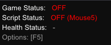
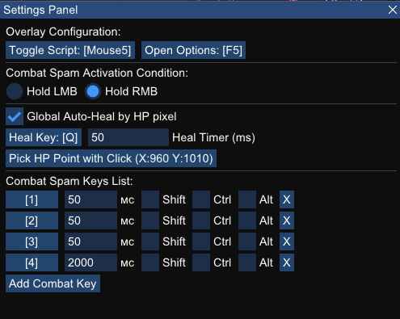
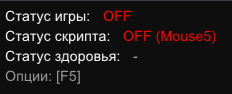
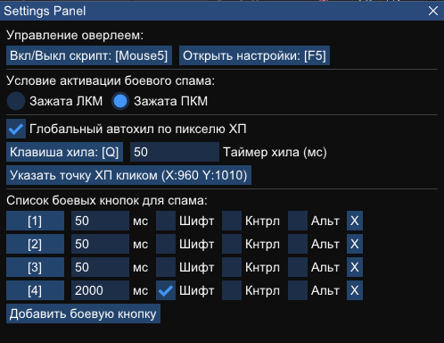

# Diablo 4 Overlay Rotation Spam

[English](#english) | [Русский](#русский)

Latest version for Windows/Последняя версия для Windows
https://github.com/pdx15/Diablo-4-Rotation-Spam/releases/latest

---

## English

A lightweight, high-performance overlay and macro automation tool for Diablo 4, written in pure C++ using **Dear ImGui** and **DirectX 11**. It bypasses high CPU usage common with scripting engines and provides a minimal footprint.

### Features
* **Minimalist Status HUD:** A compact transparent window showing Game, Script, Health, the active profile, and Options/Events hotkeys over the game.
* **Smart Click-Through:** The overlay is completely click-through while gaming. Pressing the custom Options key instantly activates the cursor for configuration.
* **Global Pixel Auto-Heal:** Scans the selected health point and heals when HP is low. By default it follows the combat spam activation condition; enable **Independent operation** to heal without holding a combat mouse button.
* **Interactive Position Picker:** Click a single button in settings, then left-click anywhere on your screen to set the exact health pixel coordinates.
* **Dynamic Combat Spam:** Add any number of skills with custom independent millisecond timers.
* **Persistent Settings:** Automatically saves your hotkeys, profiles, timers, and pixel configurations to `%APPDATA%\d4rt\config.txt`; the panel layout is stored in `%APPDATA%\d4rt\imgui.ini`.

### Independent auto-heal
In settings, enable **Global Auto-Heal by HP pixel**, then check **Independent operation**. Auto-heal will ignore **Always / Hold LMB / Hold RMB** while combat spam continues to follow the selected condition. Healing still requires the script to be ON, Diablo IV to be the foreground window, and low HP to be detected; the heal timer is unchanged.

The checkbox is saved per profile. It is off by default, including when loading older configurations, so existing behavior is preserved.

Regression tests and the Windows smoke-test checklist: [tests/README.md](tests/README.md).

### Events overlay
Press **F6** to show/hide a separate click-through panel below the status HUD.
The HUD displays **Events: [F6]** to the right of Options. Rebind it with
**Open Events** next to **Open Options** in settings. The binding is global and
saved in `config.txt`; older configurations get F6 (or another free function key
if F6 is already assigned). Holding the key toggles once; a conflicting binding
or the reserved exit key F9 is rejected with a localized hint.

* **World Boss** and **Legion:** countdown to the next start.
* **Helltide:** countdown to the end of its 55-minute active phase; displays
  **Break** during the remaining five minutes of the hour.
* Only hours and minutes are shown, rounded up; calculations use Unix seconds,
  with no local-time conversion. Events work even while combat automation is OFF.
* After the first opening, a background worker requests
  `https://helltides.com/api/schedule` immediately, then every five minutes
  (a minute after a failed attempt), including while the panel is hidden.
  UI rendering and combat automation never wait for HTTP.
* Valid schedules are atomically cached at `%APPDATA%\d4rt\events_cache.json`
  and restored on the next launch/opening. Network errors or invalid responses
  never overwrite the last good cache. When the published list has run out —
  for example late at night, before the next daily list appears — countdowns
  continue as predictions using the 210/25/60-minute cycles. Cache older than
  seven days is shown as expired, not live. With neither valid cache nor
  network data, the panel displays **No data**.
* English/Russian labels include loading, offline, expired-cache and write-error
  states. `Helltides.com` is a third-party source; timings may change after patches.

### Publishing a release
Maintainers can run **Actions → Release → Run workflow**, select the source branch, and enter a new version, for example `1.0.5.2`. The workflow must first be present on the repository's default branch to appear in the Actions UI.

* Accepts `X.Y.Z` or `X.Y.Z.B`, optionally prefixed with `v`. Components must be `0–65535`, without leading zeros. Choose a version newer than the latest published release so the auto-updater recognizes it.
* Runs regression tests, stamps all version definitions in `version.h`, and builds **Release x64** on Visual Studio 2026 (`v145`). The executable's file/product versions are checked before packaging.
* Publishes tag **`v1.0.5.2`**, title **`Diablo 4 Rotation Spam v1.0.5.2`**, and **`d4rt_v1052.zip`** containing `d4rt.exe` and third-party license notices, with Russian/English installation instructions and generated release notes.
* Uses the automatic `GITHUB_TOKEN` with `contents: write`; no additional secrets are required. The tag targets the dispatched commit. `version.h` is changed only in the build workspace; no branch is committed or pushed.
* Creates a draft, uploads the ZIP, then publishes it as Latest. Existing tags/releases are never overwritten. If an interrupted run leaves a draft/tag, inspect and remove only that unfinished release/tag before retrying, or choose another version.

### Interface Preview

  
  

---

## Русский

Легкая, высокопроизводительная утилита-оверлей автоматизации макросов для Diablo 4, написанная на чистом C++ с использованием **Dear ImGui** и **DirectX 11**. Она полностью исключает высокую нагрузку на процессор, свойственную обычным скриптовым движкам, и имеет минимальный размер.

### Возможности
* **Минималистичный HUD статуса:** Компактное прозрачное окно отображает статусы игры, скрипта, здоровья, активный профиль и клавиши Опций/Эвентов поверх игры.
* **Настраиваемый интерфейс:** При открытом меню настроек панели HUD и эвентов можно перетащить в любое место на любом мониторе и свободно растянуть; расположение запоминается между запусками.
* **Умный сквозной клик (Click-Through):** Оверлей полностью пропускает клики мыши во время игры. Нажатие клавиши Опций мгновенно включает курсор для настройки.
* **Глобальный автохил по пикселю:** Сканирует выбранную точку на сфере здоровья и прожимает хил при низком ХП. По умолчанию следует условию активации боевого спама; галочка **Независимая работа** позволяет хилиться без удержания боевой кнопки мыши.
* **Интерактивный выбор координат:** Нажмите одну кнопку в меню, кликните левой кнопкой мыши в любой точке экрана игры, и точные координаты ХП запишутся автоматически.
* **Динамический боевой спам:** Возможность добавлять любое количество клавиш с уникальными независимыми таймерами задержки в миллисекундах.
* **Сохранение конфигурации:** Автоматически записывает хоткеи, профили, таймеры и координаты пикселей в `%APPDATA%\d4rt\config.txt`.

### Независимый автохил
В настройках включите **Глобальный автохил по пикселю ХП**, затем отметьте **Независимая работа**. Автохил будет игнорировать условие **Всегда / Зажата ЛКМ / Зажата ПКМ**, а боевой спам продолжит следовать выбранному условию. Для хила по-прежнему нужны включённый скрипт, активное окно Diablo IV и обнаруженное низкое ХП; таймер хила не меняется.

Галочка сохраняется отдельно для каждого профиля. По умолчанию, в том числе при загрузке старых конфигураций, она выключена — прежнее поведение сохраняется.

Регрессионные тесты и чек-лист проверки в Windows: [tests/README.md](tests/README.md).

### Оверлей эвентов
Нажмите **F6**, чтобы показать/скрыть отдельное сквозное окно под основной панелью.
Справа от Опций отображается **Эвенты: [F6]**. Переназначение — кнопкой
**Открыть эвенты** справа от **Открыть настройки**. Клавиша общая для всех профилей
и сохраняется в `config.txt`. Для старых конфигов используется F6, а если она уже
занята — другая свободная функциональная клавиша. Удержание срабатывает один раз;
занятые клавиши и зарезервированная для выхода F9 отклоняются с подсказкой.

* **Мировой босс** и **Легион:** отсчёт до следующего начала.
* **Адский натиск:** отсчёт до конца 55-минутной активной фазы, затем **Перерыв**
  в течение оставшихся пяти минут часа.
* Выводятся только часы и минуты с округлением вверх. Расчёт идёт по Unix-времени,
  без пересчёта часового пояса. Эвенты работают и при выключенном боевом скрипте.
* После первого открытия отдельный поток сразу получает расписание с
  `https://helltides.com/api/schedule` и обновляет его каждые пять минут, даже
  когда панель скрыта. HTTP не блокирует интерфейс или боевую автоматизацию.
* Корректное расписание атомарно сохраняется в `%APPDATA%\d4rt\events_cache.json`
  и восстанавливается при следующем запуске/открытии. Ошибки связи и некорректные
  ответы не затирают последний рабочий кэш. Использование кэша и прогнозов помечено;
  после окончания списка отсчёт продолжается от последней известной точки по
  циклам 210/25/60 минут. Кэш старше семи дней считается устаревшим.
  При отсутствии сети и корректного кэша отображается **Нет данных**.
* Подписи и сообщения о загрузке, отсутствии связи, устаревшем кэше и ошибке записи
  переведены на русский и английский. Helltides.com — сторонний источник;
  после обновлений игры расписание может меняться.

### Публикация релиза
Для сопровождающих: откройте **Actions → Release → Run workflow**, выберите ветку с исходниками и введите новую версию, например `1.0.5.2`. Чтобы workflow появился в интерфейсе Actions, его файл сначала должен попасть в основную ветку репозитория.

* Поддерживаются `X.Y.Z` и `X.Y.Z.B`, в том числе с префиксом `v`. Каждое число — от `0` до `65535`, без ведущих нулей. Выбирайте версию новее последнего опубликованного релиза, чтобы её распознал автоапдейтер.
* Запускаются регрессионные тесты, обновляются все определения версии в `version.h`, собирается **Release x64** на Visual Studio 2026 (`v145`). Перед упаковкой проверяются файловая и продуктовая версии EXE.
* Создаются тег **`v1.0.5.2`**, заголовок **`Diablo 4 Rotation Spam v1.0.5.2`** и архив **`d4rt_v1052.zip`** с `d4rt.exe` и лицензиями сторонних компонентов, русско-английской инструкцией в описании релиза и автоматически сформированным списком изменений.
* Используется автоматический `GITHUB_TOKEN` с правом `contents: write`; дополнительные секреты не нужны. Тег указывает на коммит запуска. `version.h` изменяется только в рабочем каталоге сборки — коммиты и push в ветки не выполняются.
* Сначала создаётся черновик и загружается ZIP, затем релиз публикуется как Latest. Существующие теги и релизы не перезаписываются. Если прерванный запуск оставил черновик/тег, проверьте и удалите только этот незавершённый релиз/тег перед повтором либо выберите другую версию.

### Внешний вид интерфейса

  
  

